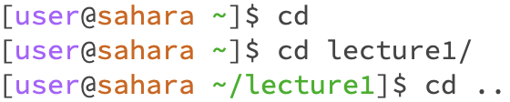
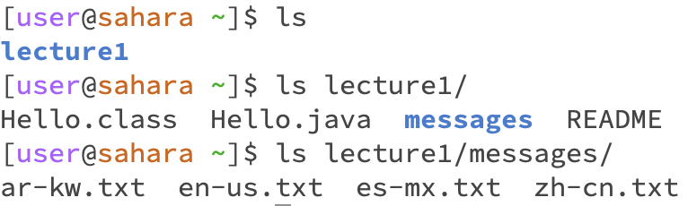

# Lab 1 Report

## Example of Command Uses

### cd

* For the first cd, no directory was specified so it did not go anywhere. No error was raised but it achieved nothing.

* For the second cd, we specify the lecture1/ directory and so we go into that directory.

* For the third cd, we specify a ".." argument, meaning that we go back to the previous directory, in this case home.

### ls

### cat