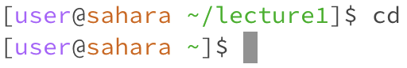
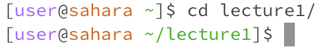
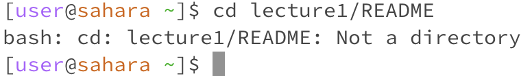
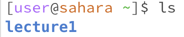
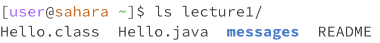
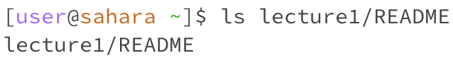
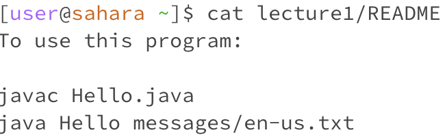
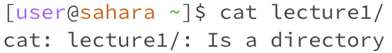
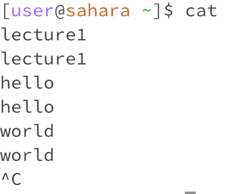

# Lab 1 Report

## Example of Command Uses

### `cd`

* Working Directory: lecture1

* For `cd` without an arg, it would change the current directory to the home directory. 

* Error: No

* Working Directory: home

* For `cd` with a directory arg, it would change the current directory to that specified directory. 

* Error: No

* Working Directory: home

* For `cd` with a file arg, it will throw an error that says that the arg is not a directory.

* Error: Yes

### `ls`

* Working Directory: home

* For `ls` without an arg, we are in the home directory, so `ls` without args lists all unhidden files and folders in the current directory (home). In this case there is one directory named lecture1.

* Error: No

* Working Directory: home

* For `ls` with a directory arg, we are in the home directory, so `ls` goes to the specified directory (lecture1) and lists all unhidden files and folders in that directory. In this case there is one directory and 3 files in the lecture1 directory.

* Error: No

* Working Directory: home

* For `ls` with a file arg, we are in the home directory, so `ls` goes to the specified file (README) and prints its relative path. In this case the relative path is lecture1/README.

* Error: No

### `cat`

* Working Directory: home

* For `cat` with a file arg, it will print the contents of the file.

* Error: No

* Working Directory: home

* For `cat` with a directory arg, it will throw an error stating that the arg is a directory.

* Error: Yes

* Working Directory: home

* For `cat` with no arg, it will simply provide an interface in which it will print back what the user wrote until the exit.

* Error: No